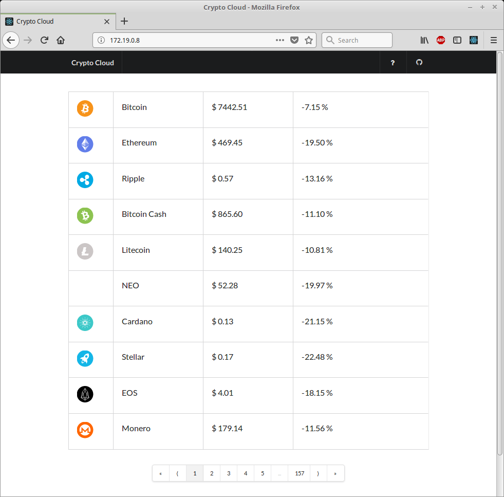

# Crypto Cloud
Personal project putting together all the stuff i learned about Microservices in the last couple of months. Project will cover service configuration, discovery, resiliency, routing, eventing, tracing and finally deployment. As i'm personal interested in crypto currencies like Ethereum et al i decided to build a "Crypto Cloud" with a couple of services around the topic. The following figure gives you a rough overview:


Services are build on top of Spring Boot, Spring Cloud and Netflix OSS using either Java or Kotlin. 

**DISCLAIMER**: This project is not a perfect use case for a microservice architecture. It is only for learning the above-mentioned techniques.

### Services

The below sections briefly describe the services. Please use this [Postman Request Collection](./Crypto-Cloud.postman_collection.json) to get a documentation of each service interface. See [Postman Docs](https://www.getpostman.com/docs/) to get more information about Postman.


#### API Gateway
The API Gateway acts as entry point to services. All requests first go through the API Gateway. It then routes requests to the appropriate service. Technology behind that is [Zuul]((https://github.com/Netflix/zuul)) together with [Spring Cloud](http://projects.spring.io/spring-cloud/). 

#### Currency Service
Simple REST API for crypto currencies.

#### Rates Collector
Responsible for collecting up-to-date currency rates from an external data source and pushing those rates into the Currency Service database. The synchronization takes place every three minutes.

### Side cars

#### Configuration Service
Sidecar to manage Crypto-Cloud wide configuration for each service. E.g. used by the currency service to configure the mongodb. The technology behind that is [Spring Cloud Config](https://cloud.spring.io/spring-cloud-config/).

#### Discovery Service
Netflix open source Service Discovery Server [Eureka](https://netflix.github.io).


#### Crypto cloud app
Web application build on top of [React.js](https://reactjs.org/) using [Semantic UI](https://react.semantic-ui.com/introduction) for styling. The app is deployed to a NGINX container. NGINX is configured to proxy the app api requests to the API gateway. See [nginx-site.conf](./crypto-cloud-app/nginx-site.conf) and [Dockerfile](./crypto-cloud-app/Dockerfile).

Thanks to cjdowner for providing a set of [icons](https://github.com/cjdowner/cryptocurrency-icons) for all the main cryptocurrencies and altcoins.

# Running the cloud on your local machine

## Pre requisites
1.	[Apache Maven](http://maven.apache.org).
2.	[Docker](http://docker.com).
3.  [Node.js](https://nodejs.org/en/)

## Building & Running the cloud on your local machine
First you have to build the code as a docker image. Therefor open a terminal, navigate to source code root directory and run the following command:

```console
   ./build.sh
```

Once the build is finished you can start the cloud with the following docker-compose command:
```console
  docker-compose -f docker/docker-compose.yml up
```

To inspect the services use the [Postman Request Collection](./Crypto-Cloud.postman_collection.json) as described above. You may have to adjust the variables to make requests.

To open the web application you have to find out the IP address of the container hosting the web application. The following command will help you:

```console
  docker inspect $(docker ps | grep 6d68/webapp | awk '{print $1}') | grep IPAddress
```
Navigating to the resulting IP address in the web browser will bring up something like this:

  

# Learning microservices
Finally a big thank you to the authors of "Building Microservices" (Sam Newman), "The TAO of Microservices" (Richard Rodger) and "Spring Microservices in Action" (John Carnell) who helped me to dive deeper in this complex topic.