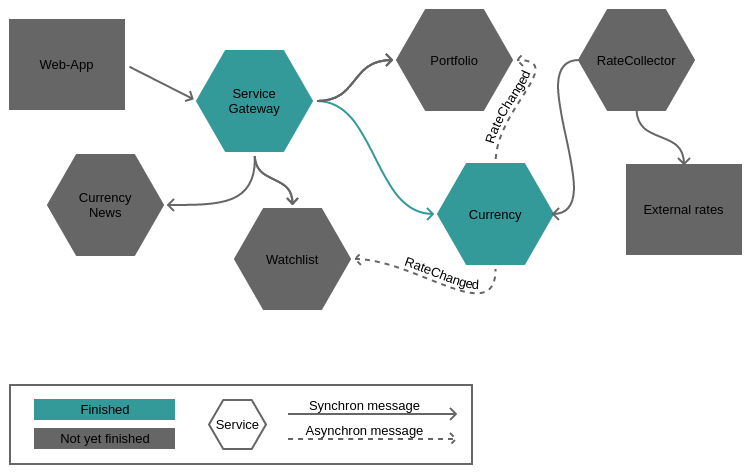

# Crypto Cloud
Personal project putting together all the stuff i learned about Microservices in the last couple of months. Project will cover service configuration, discovery, resiliency, routing, eventing, tracing and finally deployment. As i'm personal interested in crypto currencies like Ethereum et al i decided to build a "Crypto Cloud" with a couple of services around the topic. The following figure gives you a rough overview:



Services are build on top of Spring Boot, Spring Cloud and Netflix OSS using either Java or Kotlin. 

### Services
#### Currency Service

|Action|Method|Url|Body|
|---|---|---|---|
|List all currencies|GET |http://localhost:8000/currencies             ||
|Get currency by id |GET |http://localhost:8000/currencies/$currencyId$||
|Save currencies      |POST|http://localhost:8000/currencies/            |<code>[{<br>&nbsp;&nbsp;"id": "tether",<br>&nbsp;&nbsp;"name": "Tether",<br>&nbsp;&nbsp;"symbol": "USDT",<br>&nbsp;&nbsp;"lastUpdated": "1502012649",<br>&nbsp;&nbsp;"change1hInPercent": "-0.21",<br>&nbsp;&nbsp;"priceInPriceCurrency": "0.998024",<br>&nbsp;&nbsp;"priceCurrency": "USD",<br>&nbsp;&nbsp;"change7dInPercent": "-0.11",<br>&nbsp;&nbsp;"change24hInPercent": "-0.21"<br>}]</code>|

#### Configuration Service
Sidecar to manage Crypto-Cloud wide configuration for each service. E.g. used by the currency service to configure the mongodb. To see the configuration start the cloud and navigate to the [Currency Service Default Configuration](http://localhost:8888/currencyservice/default). The technology behind this configuration service is [Spring Cloud Config](https://cloud.spring.io/spring-cloud-config/)

#### Service Gateway
The Service Gateway acts as entry point to services. All requests first go through the Service Gateway. It then routes requests to the appropriate service. 

E.g. the following configuration makes the Currency Service available under http://<Service Gateway>/api/currencyservice
```yaml
zuul:
  prefix: /api
  sensitiveHeaders: Cookie,Set-Cookie
  routes:
    currencyservice:
      path: /currencyservice/**
      serviceId: currencyservice
```

Service uses Zuul Proxy together with Spring. 


# Running the cloud on your local machine

## Pre requisites
1.	[Apache Maven](http://maven.apache.org).
2.	[Docker](http://docker.com).

## Building & Running the cloud on your local machine
First you have to build the code as a docker image. Therefor open a terminal, navigate to source code root directory and run the following maven command:

   **mvn clean package docker:build**

Once the build is finished you can start the cloud with the following docker-compose command:

   **docker-compose -f docker/docker-compose.yml up**

# Learning microservices
Finally a big thank you to the authors of "Building Microservices" (Sam Newman), "The TAO of Microservices" (Richard Rodger) and "Spring Microservices in Action" (John Carnell) who helped me to dive deeper in this complex topic.
